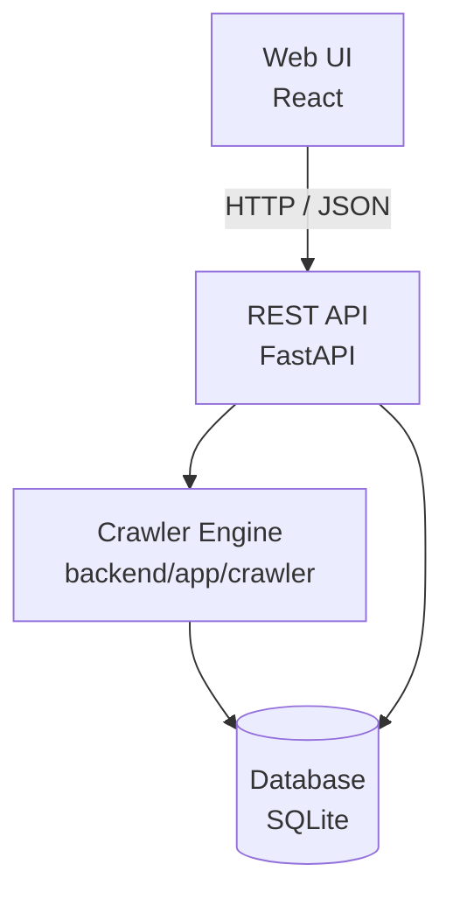

# Architecture

Gardiyan is a layered application: the Web UI talks only to the REST API over HTTP, never directly to the database or the crawler. The REST API is the only entry point into the system — it exposes CRUD/read endpoints and triggers crawl jobs. The Crawler Engine fetches and parses advisory data and writes results to the database, but it never talks to the UI directly; all crawl status and results flow back through the REST API.

