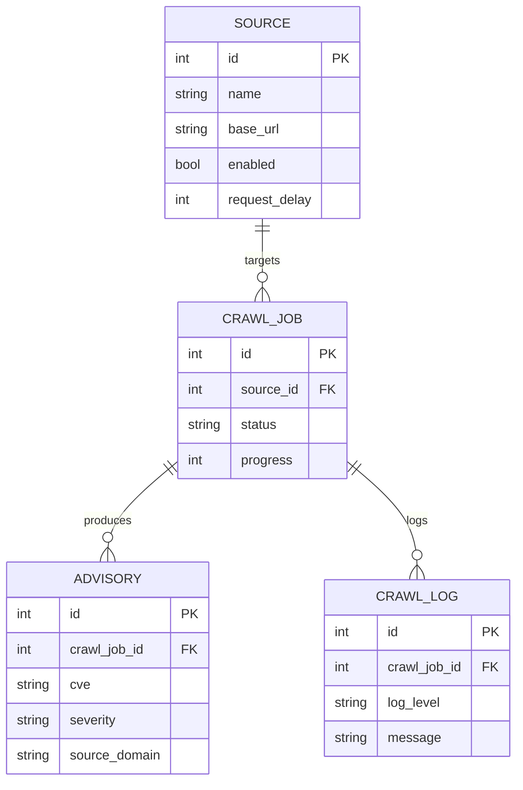

# Database Schema

## sources
| Field | Type | Notes |
|---|---|---|
| id | int, PK | |
| name | string | |
| base_url | string | |
| enabled | bool | |
| request_delay | int | seconds between requests |
| created_at | datetime | |
| updated_at | datetime | |
| last_crawl_at | datetime, nullable | |

## crawl_jobs
| Field | Type | Notes |
|---|---|---|
| id | int, PK | |
| source_id | int, FK -> sources.id | added beyond brief: a job must target one source |
| status | string | e.g. pending, running, completed, failed |
| progress | int | 0-100 |
| started_at | datetime | |
| completed_at | datetime, nullable | |
| pages_visited | int | |
| records_extracted | int | |
| error_count | int | |
| configuration | json | crawl-specific settings |

## advisories
| Field | Type | Notes |
|---|---|---|
| id | int, PK | |
| crawl_job_id | int, FK -> crawl_jobs.id | |
| title | string | |
| organization | string | |
| publication_date | date | |
| url | string | |
| source_domain | string | not a FK, just the domain string |
| cve | string | |
| product | string | |
| severity | string | |
| summary | text | |
| collection_date | datetime | |

## crawl_logs
| Field | Type | Notes |
|---|---|---|
| id | int, PK | |
| crawl_job_id | int, FK -> crawl_jobs.id | |
| timestamp | datetime | |
| log_level | string | e.g. INFO, WARNING, ERROR |
| message | text | |
| source | string | log module name, not related to sources table |
